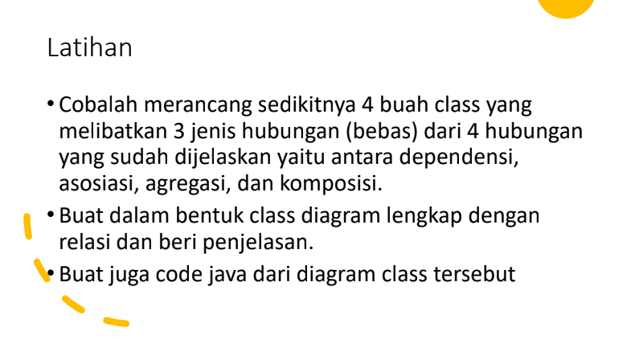
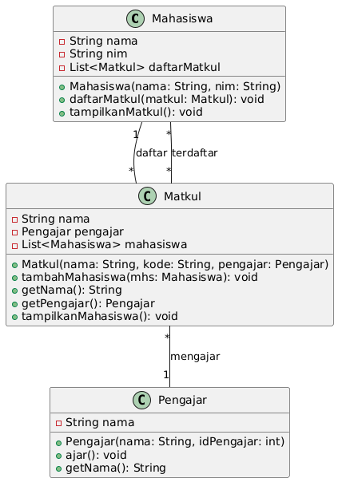

|Nama|NIM|Kelas|Mata Kuliah|
|----|---|-----|------|
|**Radityatama Nugraha**|**312310644**|**TI.23.A6**|**Pemrograman Orientasi Objek**|



# • Buat dalam bentuk class diagram lengkap dengan relasi dan beri penjelasan

## • Class Diagram



### Relasinya
```
- Mahasiswa dapat mengambil banyak mata kuliah (1 ke *).
- Mata kuliah dapat memiliki banyak mahasiswa terdaftar (* ke *).
- Mata kuliah memiliki satu pengajar (* ke 1).
```

### Penjelasanya
```
- Mahasiswa memiliki atribut nama, nim, dan daftar mata kuliah yang diambil (daftarMatkul). Mahasiswa dapat mendaftar mata kuliah dan menampilkan mata kuliah yang diambil.
- Matkul memiliki atribut nama, pengajar, dan daftar mahasiswa yang terdaftar (mahasiswa). Mata kuliah memiliki metode untuk menambah mahasiswa, menampilkan nama mata kuliah, dan menampilkan daftar mahasiswa yang terdaftar.
- Pengajar memiliki atribut nama dan metode untuk mengajar serta mendapatkan nama pengajar.
```

# • Buat juga code java dari diagram class tersebut

## • Kelas Mahasiswa
```java
import java.util.ArrayList;
import java.util.List;

class Mahasiswa {
    String nama;
    String nim;
    private final List<Matkul> daftarMatkul;

    public Mahasiswa(String nama, String nim) {
        this.nama = nama;
        this.nim = nim;
        this.daftarMatkul = new ArrayList<>();
    }

    public void daftarMatkul(Matkul matkul) {
        daftarMatkul.add(matkul);
        matkul.tambahMahasiswa(this);
    }

    public void tampilkanMatkul() {
        System.out.println("Mata kuliah yang diambil oleh " + nama + " (" + nim + "):");
        for (Matkul matkul : daftarMatkul) {
            System.out.println("- " + matkul.getNama());
        }
    }
}
```
### Penjelasan
```
Atribut:
  - nama: Menyimpan nama mahasiswa.
  - nim: Menyimpan Nomor Induk Mahasiswa (NIM).
  - daftarMatkul: Sebuah list yang menyimpan mata kuliah yang diambil oleh mahasiswa.
Konstruktor:
  - Mahasiswa(String nama, String nim): Konstruktor untuk membuat objek mahasiswa dengan nama dan NIM.
Metode:
  - daftarMatkul(Matkul matkul): Menambahkan mata kuliah ke dalam daftar mata kuliah yang diambil oleh mahasiswa dan juga menambahkan mahasiswa ke dalam daftar mahasiswa yang terdaftar pada mata kuliah tersebut.
  - tampilkanMatkul(): Menampilkan daftar mata kuliah yang diambil oleh mahasiswa, mencetak nama mata kuliah beserta NIM mahasiswa.
```

## • Kelas Matkul (Mata Kuliah)
```java
class Matkul {
    private final String nama;
    private final Pengajar pengajar;
    private final List<Mahasiswa> mahasiswa;

    public Matkul(String nama, String kode, Pengajar pengajar) {
        this.nama = nama;
        this.pengajar = pengajar;
        this.mahasiswa = new ArrayList<>();
    }

    public void tambahMahasiswa(Mahasiswa mhs) {
        mahasiswa.add(mhs);
    }

    public String getNama() {
        return nama;
    }

    public Pengajar getPengajar() {
        return pengajar;
    }

    public void tampilkanMahasiswa() {
        System.out.println("Mahasiswa yang terdaftar di mata kuliah " + nama + ":");
        for (Mahasiswa mhs : mahasiswa) {
            System.out.println("- " + mhs.nama + " (" + mhs.nim + ")");
        }
    }
}
```
### Penjelasan
```
Atribut:
  - nama: Menyimpan nama mata kuliah.
  - pengajar: Menyimpan objek pengajar yang mengajar mata kuliah tersebut.
  - mahasiswa: Sebuah list yang menyimpan mahasiswa yang terdaftar dalam mata kuliah tersebut.
Konstruktor:
  - Matkul(String nama, String kode, Pengajar pengajar): Konstruktor untuk membuat objek mata kuliah dengan nama, kode mata kuliah, dan pengajar yang mengajarnya.
Metode:
  - tambahMahasiswa(Mahasiswa mhs): Menambahkan mahasiswa ke dalam daftar mahasiswa yang terdaftar pada mata kuliah tersebut.
  - getNama(): Mengembalikan nama mata kuliah.
  - getPengajar(): Mengembalikan objek pengajar yang mengajar mata kuliah ini.
  - tampilkanMahasiswa(): Menampilkan daftar mahasiswa yang terdaftar dalam mata kuliah tersebut.
```

## • Kelas Pengajar
```java
class Pengajar {
    private final String nama;

    public Pengajar(String nama, int idPengajar) {
        this.nama = nama;
    }

    public void ajar() {
        System.out.println(nama + " sedang mengajar.");
    }

    public String getNama() {
        return nama;
    }
}
```
### Penjelasan
```
Atribut:
  - nama: Menyimpan nama pengajar.
Konstruktor:
  - Pengajar(String nama, int idPengajar): Konstruktor untuk membuat objek pengajar dengan nama dan ID pengajar (meskipun ID tidak digunakan dalam kode ini).
Metode:
  - ajar(): Menampilkan pesan bahwa pengajar sedang mengajar.
  - getNama(): Mengembalikan nama pengajar.
```

## • Kelas Main
```java
public class main {
    public static void main(String[] args) {
        Pengajar pengajar1 = new Pengajar("Yoga", 312310569);
        Pengajar pengajar2 = new Pengajar("Agus", 312310597);

        Matkul matkul1 = new Matkul("Pemrograman Web", "CS101", pengajar1);
        Matkul matkul2 = new Matkul("Pemrograman Mobile", "CS102", pengajar2);

        Mahasiswa mhs1 = new Mahasiswa("Radit", "312310644");
        Mahasiswa mhs2 = new Mahasiswa("Romi", "312310581");

        mhs1.daftarMatkul(matkul1);
        mhs1.daftarMatkul(matkul2);
        mhs2.daftarMatkul(matkul1);

        mhs1.tampilkanMatkul();
        mhs2.tampilkanMatkul();

        matkul1.tampilkanMahasiswa();
        matkul2.tampilkanMahasiswa();

        System.out.println("Pengajar mata kuliah " + matkul1.getNama() + ": " + matkul1.getPengajar().getNama());
        pengajar1.ajar();
        System.out.println("Pengajar mata kuliah " + matkul2.getNama() + ": " + matkul2.getPengajar().getNama());
        pengajar2.ajar();
    }
}
```
### Penjelasan
```
- Metode main: Merupakan titik masuk program yang membuat objek-objek dari kelas Pengajar, Matkul, dan Mahasiswa serta mengatur interaksi antar objek:
  - Membuat Pengajar:
    - pengajar1 dan pengajar2 adalah objek pengajar yang bernama "Yoga" dan "Agus".
  - Membuat Mata Kuliah:
    - matkul1 adalah mata kuliah "Pemrograman Web" yang diajarkan oleh pengajar1.
    - matkul2 adalah mata kuliah "Pemrograman Mobile" yang diajarkan oleh pengajar2.
  - Membuat Mahasiswa:
    - mhs1 dan mhs2 adalah objek mahasiswa dengan nama "Radit" dan "Romi".
  - Menambahkan Mahasiswa ke Mata Kuliah:
    - mhs1 mendaftar pada matkul1 dan matkul2.
    - mhs2 mendaftar pada matkul1.
  - Menampilkan Mata Kuliah yang Diambil Mahasiswa:
    - Program menampilkan daftar mata kuliah yang diambil oleh setiap mahasiswa menggunakan metode tampilkanMatkul().
  - Menampilkan Mahasiswa yang Terdaftar di Mata Kuliah:
    - Program menampilkan daftar mahasiswa yang terdaftar di setiap mata kuliah menggunakan metode tampilkanMahasiswa().
  - Menampilkan Pengajar dan Aktivitas Mengajar:
    - Program menampilkan nama pengajar dan aktivitas mengajar untuk setiap mata kuliah menggunakan metode ajar().
```
